# SecureAssess Platform

**A modular, plugin-based Dynamic Application Security Testing (DAST) platform for authorized, non-destructive web application security assessments.**

[](./package.json)
[](./package.json)
[](./LICENSE)
[](./package.json)
[](https://playwright.dev/)

> [!IMPORTANT]
> SecureAssess is intended **only for systems you own or have written authorization to test**. Unauthorized scanning may be illegal.

---

## Table of contents

- [Overview](#overview)
- [Screenshots](#screenshots)
- [Features](#features)
- [Architecture](#architecture)
- [Repository structure](#repository-structure)
- [Scan lifecycle](#scan-lifecycle)
- [Plugin system](#plugin-system)
- [Knowledge Repository](#knowledge-repository)
- [Event Bus](#event-bus)
- [Reporting](#reporting)
- [Configuration](#configuration)
- [Safety principles](#safety-principles)
- [Development guide](#development-guide)
- [Demo targets](#demo-targets)
- [Contributing](#contributing)
- [Roadmap](#roadmap)
- [Documentation](#documentation)
- [License](#license)
- [Support](#support)

---

## Overview

**SecureAssess** is an enterprise-oriented DAST platform that assesses web applications and APIs using browser automation (Playwright), HTTP probing, and a plugin-based security module system.

### Why it exists

Security teams need repeatable, evidence-backed assessments that:

- Stay within **authorized, non-destructive** boundaries
- Map findings to **OWASP / CWE / CAPEC / CVSS** style standards
- Produce reports suitable for engineers, auditors, and CI pipelines
- Extend cleanly when new vulnerability classes are required

### Problems it solves

| Problem | Approach |
|---------|----------|
| Ad-hoc scripts that do not scale | Layered engines + plugin modules |
| False-positive noise | Verification gates, baseline compare, finding family dedupe |
| Missing authenticated coverage | Optional login / session attachment |
| Opaque results | Multi-format reports + evidence screenshots |
| Hard-to-extend scanners | Auto-registered plugins under `modules/` |

### Architecture philosophy

- **Safe by default** — authorization required; destructive and DoS behaviors forbidden
- **Thin orchestrator** — `ScanOrchestrator` coordinates; engines own domain logic
- **Shared knowledge** — engines read/write a per-scan `KnowledgeRepository`
- **Event-driven stages** — `ScanEventBus` publishes stage and finding lifecycle events
- **Plugins as the extension point** — new checks ship as modules without rewriting the core

---

## Screenshots

<details>
<summary><strong>Assessment UI</strong></summary>

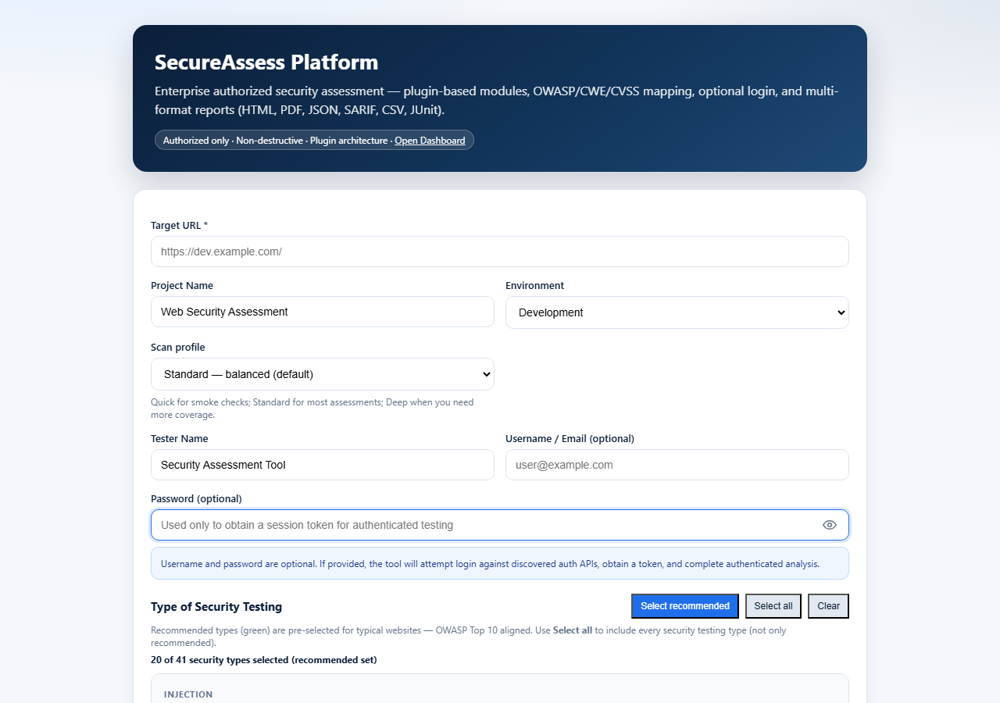

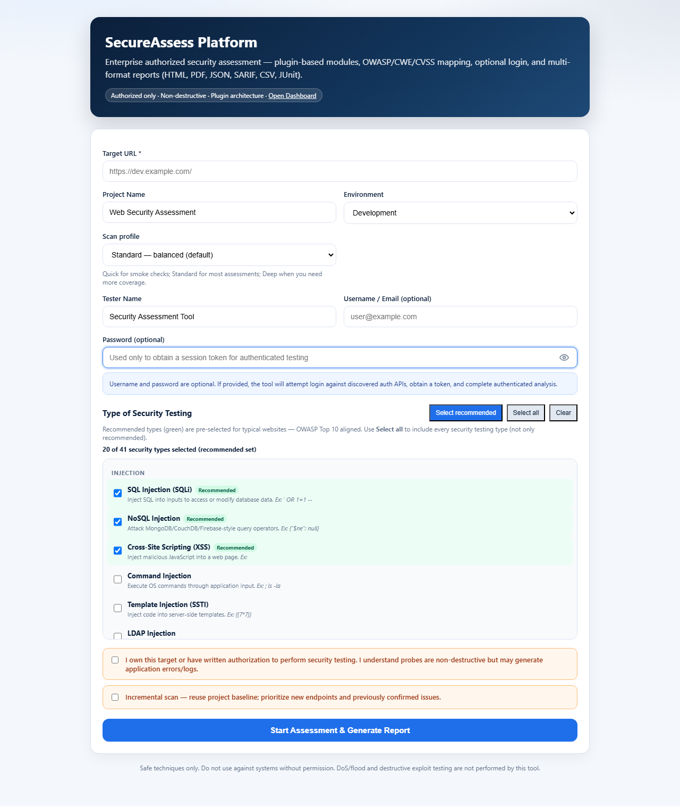

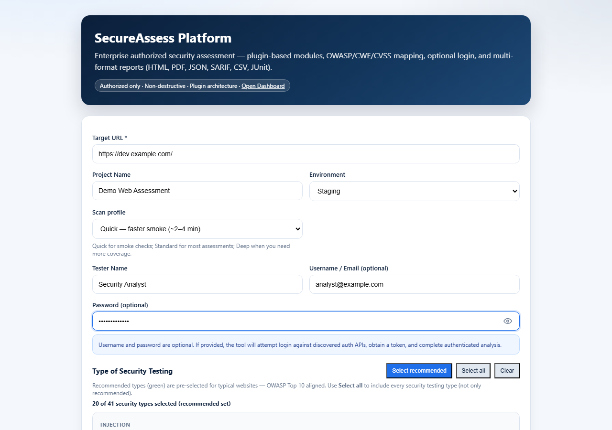

</details>

<details>
<summary><strong>Security types, auth, and start</strong></summary>


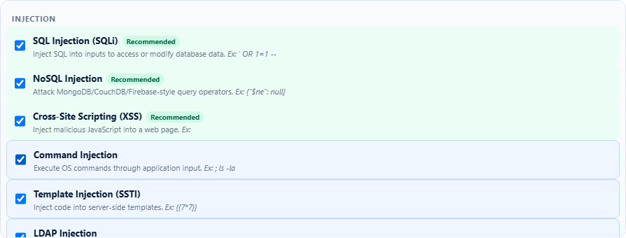

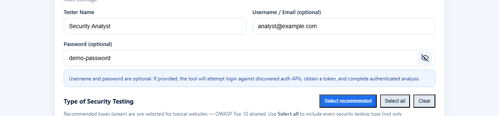

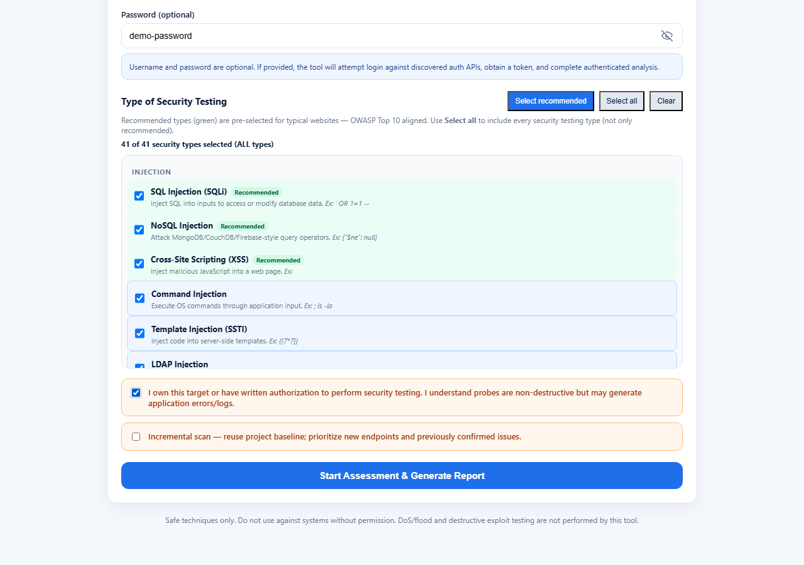

</details>

<details>
<summary><strong>Dashboard and mobile</strong></summary>

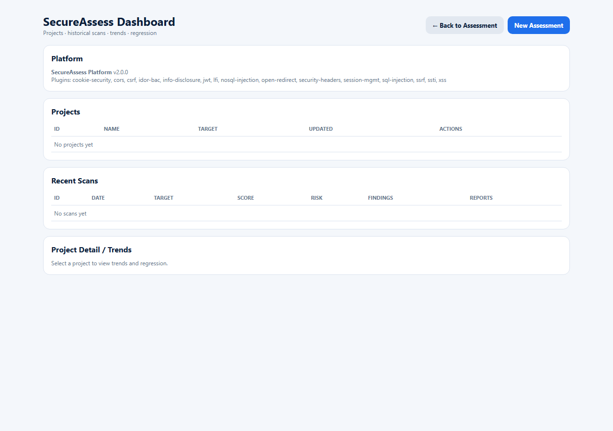

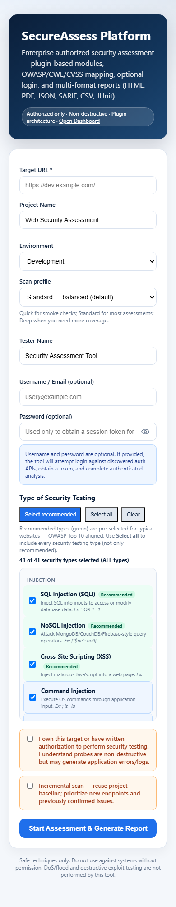

</details>

---

## Features

Capabilities below are implemented in the current codebase.

| Capability | Description |
|------------|-------------|
| **Browser-based scanning** | Playwright Chromium for crawl, forms, scripts, and browser-lane plugins |
| **API / HTTP scanning** | HTTP-lane plugins probe discovered endpoints and parameters |
| **Plugin architecture** | Auto-registered modules under `modules/` via `manifest.json` |
| **Attack surface discovery** | Crawl, sitemap, OpenAPI parsing, forms, auth re-crawl |
| **Technology fingerprinting** | `FingerprintEngine` records stack signals for planning relevance |
| **Session management** | `SessionEngine` / `AuthEngine` for optional authenticated assessments |
| **Scan planning** | Priority task queue with HTTP vs browser lanes and incremental boosts |
| **Parallel HTTP probing** | Configurable `httpLaneConcurrency` (default 4) |
| **Verification engine** | Multi-signal gates, confidence tempering, family merge |
| **Baseline comparison** | Clean-vs-probe diffs (e.g. XSS) + project baselines for incremental scans |
| **Evidence collection** | Screenshots / HTTP evidence for verified findings |
| **Risk scoring** | Aggregated risk summary and score with family diminishing returns |
| **Professional reporting** | HTML, PDF, JSON, SARIF, CSV, JUnit |
| **Scan profiles** | Quick / Standard / Deep |
| **Event-driven stages** | `ScanEventBus` for stage and finding lifecycle events |
| **Project dashboard** | History, trends hooks, regression compare APIs |
| **Target policy** | Blocks private/metadata targets by default; optional allowlist / API key |

> [!NOTE]
> There is **no separate Aggregation Engine** class. Finding merge/dedupe and risk aggregation are handled by the **Verification Engine**, **Knowledge Repository**, and **Risk Engine**.

---

## Architecture

### Pipeline diagram

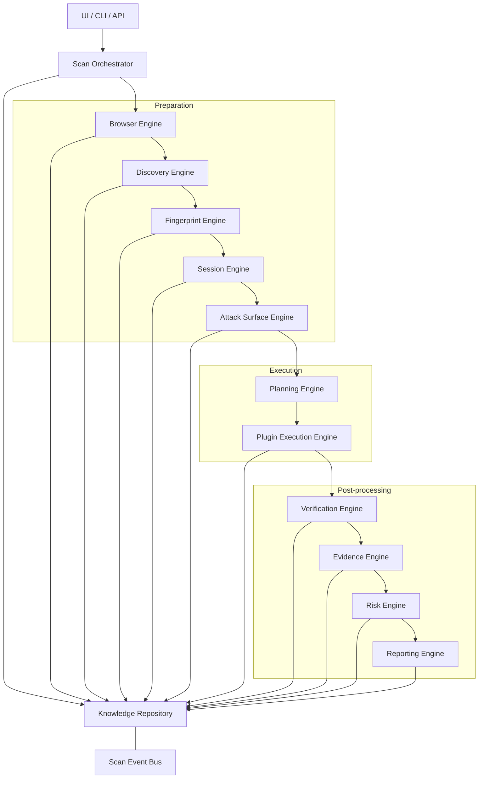

### Engine responsibilities

| Engine | Responsibility |
|--------|----------------|
| **Scan Orchestrator** | Thin coordinator: applies profile, runs stages in order, persists results |
| **Browser Engine** | Owns Playwright browser/context/page lifecycle for the scan |
| **Discovery Engine** | Crawl, sitemap, OpenAPI, forms, script hints; produces recon data |
| **Fingerprint Engine** | Technology / framework signals used for planning relevance |
| **Session Engine** | Attaches authenticated session (cookies/tokens) when credentials are supplied |
| **Attack Surface Engine** | Normalizes recon into endpoints, parameters, and surface inventory |
| **Knowledge Repository** | Per-scan shared state + embedded event bus |
| **Planning Engine** | Builds prioritized plugin task queue (lanes, focus, incremental boosts) |
| **Plugin Execution Engine** | Runs plugins on HTTP lane (parallel) and browser lane (limited concurrency) |
| **Verification Engine** | Confidence/severity gates, precision rules, family dedupe/merge |
| **Evidence Engine** | Captures screenshots / HTTP evidence for verified findings |
| **Risk Engine** | Scores and summarizes verified findings |
| **Reporting Engine** | Writes HTML/PDF/JSON/SARIF/CSV/JUnit artifacts |
| **Job Controller** | In-memory job lifecycle, progress, cancel (API layer) |

Supporting engines (wired for recon/auth compatibility): `ReconEngine`, `AuthEngine`, `KnowledgeEngine`.

<details>
<summary><strong>Advanced: finding aggregation (no separate Aggregation Engine)</strong></summary>

SecureAssess does not ship a standalone `AggregationEngine`. Equivalent responsibilities are split as follows:

- **Verification Engine** — merges same-family findings and tempers weak High/Criticals  
- **Knowledge Repository** — accumulates draft/verified findings and coverage  
- **Risk Engine** — aggregates severity into score / risk summary for reports  

</details>

---

## Repository structure

```
config/                 # default.json, safety.json, optional env overlays
docs/                   # Architecture, API, guides, screenshots
modules/                # Security plugins (auto-register via manifest.json)
public/                 # Assessment UI (index.html) + dashboard
src/
  platform/             # API, bootstrap/DI, engines, plugins, dashboard store
  scanner/              # Proven Playwright recon / probe helpers reused by plugins
  report/               # HTML/PDF report builders
scripts/                # Utility scripts
tests/                  # Vitest unit/integration-style tests
data/                   # Local projects, scans, baselines (gitignored content)
reports/                # Generated scan reports (gitignored)
```

| Path | Purpose |
|------|---------|
| `src/platform/api/` | Express HTTP API and static UI hosting |
| `src/platform/engines/` | Domain engines (browser → reporting) |
| `src/platform/core/` | Types, DI, config, safety, knowledge, standards mappings |
| `src/platform/plugins/` | `PluginManager` and shared plugin helpers |
| `modules/*` | One plugin package per security check |
| `docs/screenshots/` | README UI screenshots |

---

## Scan lifecycle

```text
Scan Request
    ↓
Profile + authorization / target policy
    ↓
Browser session
    ↓
Discovery (crawl / OpenAPI / sitemap / forms)
    ↓
Fingerprint
    ↓
Session / Auth (optional)
    ↓
Attack surface normalization
    ↓
Planning (task queue, lanes, priorities)
    ↓
Plugin execution (HTTP ∥ + browser)
    ↓
Verification (precision gates + family merge)
    ↓
Evidence (verified findings)
    ↓
Risk evaluation
    ↓
Reporting + project / baseline persistence
```

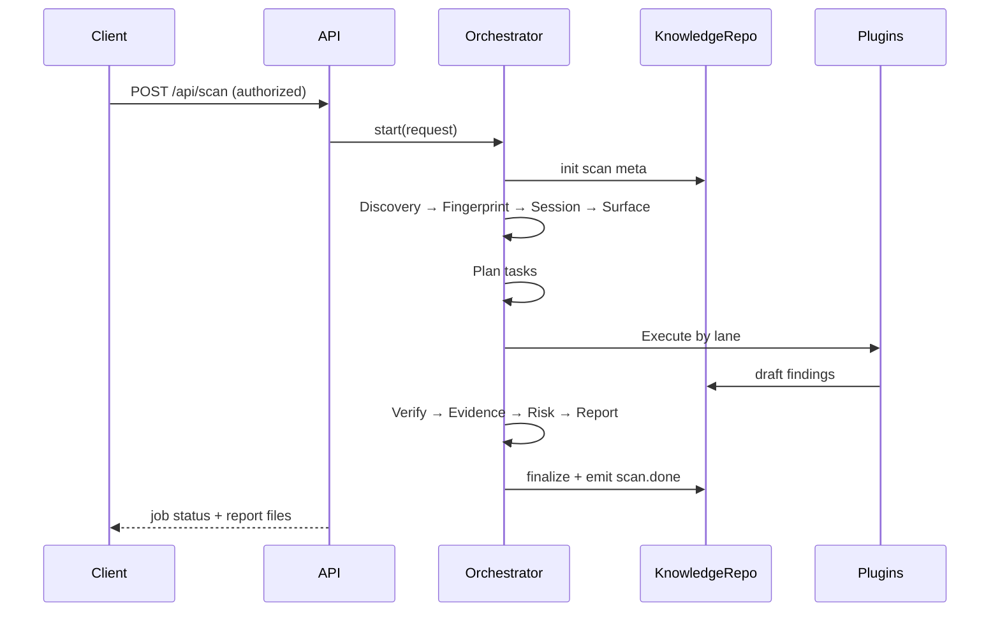

---

## Plugin system

### Lifecycle

1. **Register** — on boot, `PluginManager.autoRegister()` scans `modules/*/manifest.json`
2. **Plan** — `ScanPlanningEngine` selects relevant plugins/tasks for the surface
3. **Discover** (optional) — plugin may contribute targets/parameters
4. **Scan** — plugin emits draft findings into the knowledge store
5. **Verify** — platform verification runs after plugin execution
6. **Report** — verified findings flow into risk + reporting

### Responsibilities

Plugins **should**:

- Stay within `active-safe` / configured mode
- Return structured findings (severity, confidence, evidence, CWE mappings)
- Prefer shared helpers (`paramRank`, `baselineCompare`, probe utilities)

Plugins **must not**:

- Perform destructive actions, DoS, malware upload, or persistence
- Bypass authorization or target policy

### Registration

```text
modules/<plugin-id>/
  manifest.json      # id, name, version, securityTypeIds, modes, ...
  scanner.js         # createPlugin / default export
  README.md          # optional module notes
```

### Isolation and communication

- Plugins run inside the **Plugin Execution Engine** with lane-level concurrency limits
- Failures in one plugin are isolated; other plugins continue
- Communication is **indirect**: plugins write findings/context via the scan **PluginContext** and **Knowledge Repository**; stage progress is published on the **Scan Event Bus**

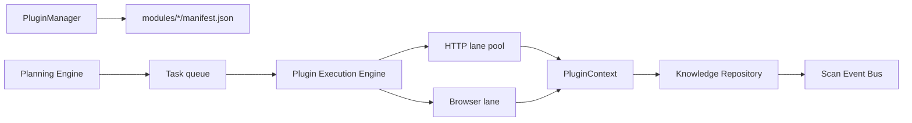

<details>
<summary><strong>Shipped plugins</strong></summary>

| Plugin ID | Focus |
|-----------|--------|
| `sql-injection` | SQL injection (safe detection) |
| `nosql-injection` | NoSQL operator injection |
| `xss` | XSS indicators + baseline compare |
| `ssti` | Server-side template injection |
| `lfi` | Local file inclusion indicators |
| `idor-bac` | IDOR / BOLA / broken access control |
| `jwt` | JWT misconfiguration |
| `csrf` | CSRF protections |
| `open-redirect` | Open redirect |
| `ssrf` | SSRF indicators |
| `security-headers` | HTTP security headers |
| `cors` | CORS misconfiguration |
| `info-disclosure` | Sensitive files / info leaks |
| `cookie-security` | Cookie hardening |
| `session-mgmt` | Session management checks |

</details>

---

## Knowledge Repository

### Why it exists

Engines need a single, consistent view of the current scan without passing large unstructured objects through every call site.

### What it stores (per scan)

- Scan metadata (target, profile, mode, auth flags)
- Discovery / recon output
- Fingerprint
- Auth / session state
- Attack surface inventory
- Draft and verified findings
- Type coverage and plugin IDs
- Phase timings, plan, stage
- Risk and assessment summaries
- Embedded **Scan Event Bus**

### Who uses it

Orchestrator, Discovery, Fingerprint, Session, Attack Surface, Planning, Plugin Execution, Verification, Evidence, Risk, Reporting, and the dashboard persistence path (`ProjectStore`).

### Benefits

- Decouples engines
- Enables incremental baselines
- Supports event subscribers without tight coupling
- Simplifies testing with in-memory state

---

## Event Bus

SecureAssess uses **`ScanEventBus`** (`src/platform/core/knowledge/ScanEventBus.ts`) for stage and finding lifecycle signals.

### Why event-driven stages

- Orchestrator remains thin
- Progress and observability do not require hard-wiring every consumer
- Future UI/CLI listeners can subscribe without changing engine internals

### Publishing

Engines / repository emit events such as:

| Event | Meaning |
|-------|---------|
| `stage.start` / `stage.end` | Pipeline stage boundaries |
| `page.found` / `endpoint.found` | Discovery progress |
| `plan.created` | Planning complete |
| `finding.draft` / `finding.verified` | Finding lifecycle |
| `coverage.updated` | Security-type coverage changes |
| `scan.error` / `scan.done` | Terminal outcomes |

### Subscribers

Consumers attach via the bus on the knowledge repository (and job progress is also surfaced through `JobController`, which extends Node’s `EventEmitter` for API polling).

### Advantages

- Loose coupling between producers and observers
- Clear scan timeline for logging and UI status
- Extensible without rewriting the orchestrator

---

## Reporting

### Supported formats

| Format | Use |
|--------|-----|
| **HTML** | Interactive technical report |
| **PDF** | Shareable / executive-friendly export |
| **JSON** | Full machine-readable result |
| **SARIF** | CI / code-scanning integrations |
| **CSV** | Spreadsheet review |
| **JUnit** | CI gate / test reporting |

Configured in `config/default.json` → `reporting.formats`.

### Reporting workflow

1. Verification completes and findings are finalized  
2. Evidence Engine attaches screenshots/HTTP evidence (configurable filters)  
3. Risk Engine produces score / summary  
4. Reporting Engine writes artifacts under `reports/`  
5. Job API returns file paths (`html`, `pdf`, `json`, `sarif`, `csv`, `junit`)  
6. Project store persists scan meta for the dashboard  

> [!WARNING]
> Report and scan data may contain **target URLs and assessment context**. `reports/` and `data/scans|projects` are gitignored — do not commit real customer reports.

---

## Configuration

### Environment variables

| Variable | Purpose |
|----------|---------|
| `PORT` | HTTP listen port (default `3847`) |
| `SECUREASSESS_ENV` | Optional config overlay name (`config/<env>.json`) |
| `NODE_ENV` | Fallback overlay selector |
| `SECUREASSESS_API_KEY` | If set, require `x-api-key` on API calls |
| `SECUREASSESS_ALLOW_PRIVATE` | Set `1` to allow private/lab targets |
| `SECUREASSESS_ALLOWLIST` | Comma-separated host allowlist (e.g. `example.com,.example.com`) |

### Scan options (API / UI)

- `targetUrl`, `projectName`, `environment`, `testerName`
- `username` / `password` / `apiKey` / `authHeader` (optional auth)
- `securityTypes` / `pluginIds`
- `profile`: `quick` \| `standard` \| `deep`
- `mode`: `passive` \| `active-safe` \| `authenticated`
- `authorized`: **must be `true`**
- `incremental`: reuse project baseline when available

### Browser, parallelism, timeouts

Primary keys in `config/default.json`:

| Key | Default | Meaning |
|-----|---------|---------|
| `scan.browserLaneConcurrency` | `1` | Parallel browser-lane plugin tasks |
| `scan.httpLaneConcurrency` | `4` | Parallel HTTP-lane probes |
| `safety.maxConcurrentProbes` | `6` | Global probe concurrency cap |
| `safety.requestTimeoutMs` | `10000` | Per-request timeout |
| `safety.rateLimitPerHostPerMinute` | `120` | Host rate limit |
| `scan.discovery.maxPagesCrawl` | `8` | Crawl breadth (profiles may override) |
| `scan.workerThreads` | `false` | Worker-thread offload (disabled by default) |

### Authentication

- Optional UI/CLI credentials trigger login against discovered auth endpoints  
- Supports common form / cookie / token flows (including cookie-session apps)  
- Secrets should be supplied at runtime only — never committed  

See [Configuration Guide](docs/Configuration-Guide.md).

---

## Safety principles

> [!CAUTION]
> Use SecureAssess **only** for authorized security assessments.

| Principle | Implementation |
|-----------|----------------|
| **Authorization required** | UI checkbox / `authorized: true` / CLI `--yes` |
| **Non-destructive scanning** | Default mode `active-safe`; `allowDestructive: false` |
| **No DoS behavior** | `allowDoS: false`; rate limits and crawl/probe caps |
| **Rate limiting** | Per-host request budgets |
| **Secret redaction** | `redactSecrets` for persisted results |
| **Safe verification** | Precision gates reduce weak High/Critical noise; no exploit weaponization |
| **Target policy** | Private/loopback/metadata blocked unless explicitly allowed |
| **Forbidden behaviors** | Enumerated in `config/safety.json` (malware, persistence, priv-esc, etc.) |

---

## Development guide

### Prerequisites

- Node.js 18+
- npm
- Playwright Chromium (installed via `postinstall`)

### Install

```bash
npm install
```

### Build

```bash
npm run build
```

### Run (production build)

```bash
npm start
```

Open http://localhost:3847 (UI) and http://localhost:3847/dashboard.html (dashboard).

### Run (development)

```bash
npm run start:dev
```

### CLI scan

```bash
npm run scan -- --url https://dev.example.com --yes
```

### Demo targets

Prove the install without using a production app:

| Path | Target | Doc |
|------|--------|-----|
| Smoke | `https://httpbin.org` (Quick) | [Demo Targets](docs/Demo-Targets.md#a-smoke--httpbin) |
| Lab | OWASP Juice Shop on Docker (`localhost:3000`) | [Demo Targets](docs/Demo-Targets.md#b-lab--owasp-juice-shop) |

```bash
# Smoke (fast)
npm run scan -- --url https://httpbin.org --profile quick --yes --out reports

# Lab (Docker Juice Shop must be running on :3000)
npm run scan -- --url http://localhost:3000 --profile quick --yes --out reports
```

Full steps, focused routes, dual-account notes: [docs/Demo-Targets.md](docs/Demo-Targets.md).

### CI gate (Confirmed High/Critical)

```bash
npm run ci:gate -- --json reports/<scan>.json
```

See [docs/CI-Packaging.md](docs/CI-Packaging.md) and `.github/workflows/secureassess.yml`.

### Tests, lint, typecheck

```bash
npm test
npm run lint
npm run typecheck
```

| Script | Purpose |
|--------|---------|
| `npm start` | Run compiled server from `dist/` |
| `npm run start:dev` | Run TypeScript server with `tsx` |
| `npm run build` | Compile TypeScript |
| `npm run build:run` | Build then start |
| `npm run scan` | Platform CLI |
| `npm run ci:gate` | Fail CI on Confirmed High/Critical |
| `npm test` | Vitest |
| `npm run lint` | ESLint |
| `npm run format` | Prettier |

---

## Contributing

### Coding standards

- TypeScript for platform engines; JavaScript acceptable in plugins where existing modules use JS
- Prefer small, focused engines and pure helpers
- Do not add destructive payloads or DoS behavior
- Do not commit secrets, real reports, or customer data
- Match existing naming and folder conventions

### Branch naming

Suggested convention:

```text
feature/<short-description>
fix/<short-description>
docs/<short-description>
plugin/<plugin-id>
```

### Pull request process

1. Fork / branch from the default branch  
2. Keep PRs focused (one concern when possible)  
3. Ensure `npm test` and `npm run typecheck` pass  
4. Update docs when behavior or APIs change  
5. Describe **why** in the PR body; note safety impact if any  

### Plugin development guidelines

1. Create `modules/<id>/` with `manifest.json` + scanner entry  
2. Map findings via platform standards helpers  
3. Add tests under `tests/` where practical  
4. Document the module (short README)  
5. Restart the server so auto-register picks up the plugin  

See [Plugin Development Guide](docs/Plugin-Development-Guide.md).

### Documentation expectations

- User-facing behavior → README or `docs/`  
- Architecture decisions → `docs/` (and ADRs when applicable)  
- Do not document unimplemented features as shipped  

---

## Roadmap

### Current

- Architecture v2 engines (browser → reporting) — complete  
- Deep-scan plugins (XSS, IDOR, JWT, CSRF, redirect, SSRF, SSTI, LFI, cookie, session) — complete  
- Precision pack (`verification-baseline-v1`) — multi-signal gates, baseline XSS, param ranking, profiles  
- Multi-format reporting + project dashboard  
- Authorized / non-destructive safety controls  

### Planned

- Baseline compare extended across more injection families (SQLi, SSTI, redirect)  
- Dual-account IDOR (user A vs user B) for stronger BAC confirmation  
- First-class incremental regression UI (new / fixed / unchanged findings)  
- In-repo “known good” fixture for deterministic CI assertions  
- `CONTRIBUTING.md` at repository root  


### Future

- Richer fingerprint-driven plugin scheduling  
- Optional worker-thread offload (`scan.workerThreads`)  
- Expanded authenticated workflow wizard (cookie vs JWT vs form)  
- Additional plugins only when driven by real assessment needs  

---

## Documentation

| Document | Status |
|----------|--------|
| [Architecture](docs/Architecture.md) | Available |
| [Architecture v2 phases](docs/Architecture-V2-Phases.md) | Available |
| [Deep Scan Roadmap](docs/Deep-Scan-Roadmap.md) | Available |
| [Precision Improvements](docs/Precision-Improvements.md) | Available |
| [API Documentation](docs/API.md) | Available |
| [Configuration Guide](docs/Configuration-Guide.md) | Available |
| [Plugin Development Guide](docs/Plugin-Development-Guide.md) | Available (Plugin SDK) |
| [Developer Guide](docs/Developer-Guide.md) | Available |
| [Deployment Guide](docs/Deployment-Guide.md) | Available |
| [Module Documentation](docs/Module-Documentation.md) | Available |
| [Demo Targets](docs/Demo-Targets.md) | Available — httpbin smoke + Juice Shop lab |
| [CI Packaging](docs/CI-Packaging.md) | Available |
| [Security Policy](./SECURITY.md) | Available — private advisory + email |
| Contributing Guide (`CONTRIBUTING.md`) | Placeholder — see [Contributing](#contributing) |

---

## License

Copyright (c) 2026 Zubair Khan Shinwari. Licensed under the [MIT License](./LICENSE).

Use SecureAssess only on systems you own or are explicitly authorized to test. The software is provided as-is; assessment results are not a guarantee of security.

---

## Support

| Need | How |
|------|-----|
| **Bug report** | Open a GitHub Issue with steps to reproduce, SecureAssess version, Node version, and whether the target was authorized. **Do not attach credentials or confidential reports.** |
| **Feature request** | Open a GitHub Issue with the use case, expected behavior, and safety constraints. |
| **Questions** | Use GitHub Discussions (if enabled) or an Issue labeled `question`. |

For security-sensitive disclosures about SecureAssess itself, see [SECURITY.md](./SECURITY.md) (GitHub private advisory preferred; email also accepted).

---

<p align="center">
  <sub>SecureAssess Platform · Authorized assessments only · Non-destructive by design</sub>
</p>
